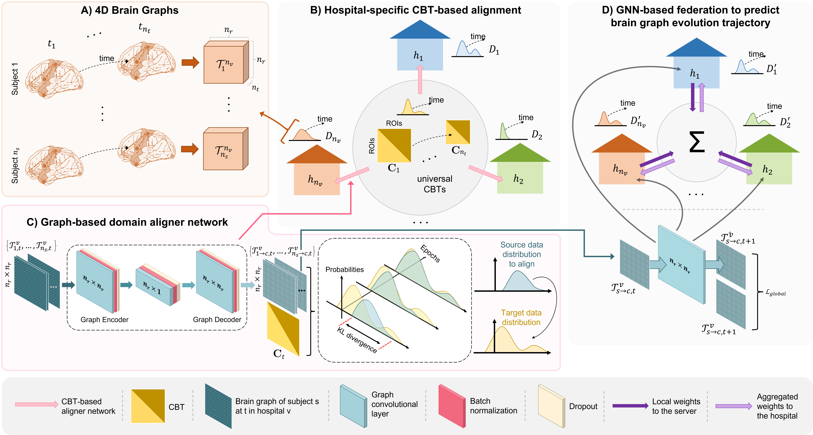

# TAF-GNN
TAF-GNN, a template-based federated multiview domain alignment for brain graph evolution trajectory prediction framework that learns from heterogeneous brain connectivity data, coded up in Python by Emircan Gündoğdu. Please contact gundogduemircann@gmail.com for inquiries. Thanks.



# Introduction
 
This work is accepted at the PRIME workshop in MICCAI 2023.

> **Federated Brain Graph Evolution Prediction using Decentralized Connectivity Datasets with Temporally-varying Acquisitions**

> [Emircan Gündoğdu](https://github.com/emircangun)<sup>1,2</sup>, [Islem Rekik](https://basira-lab.com/)<sup>1</sup>
> 
> <sup>1</sup>BASIRA Lab, Imperial-X and Department of Computing, Imperial College London, London, UK
> <sup>2</sup>Faculty of Computer and Informatics Engineering, Istanbul Technical University, Istanbul, Turkey
>
> **Abstract:** Predicting the brain graph (or connectome) evolution trajectory can aid in the early diagnosis of neurological disorders or even prior to onset. However, when dealing with heterogeneous datasets collected from various hospitals, each representing a unique domain (e.g., functional connectivity), the task of prediction becomes even more challenging within a federated learning (FL) context. To the best of our knowledge, no FL method was designed to predict brain graph evolution trajectory with hospitals trained on separate data domains, which presents one of the complex non-IID and data heterogeneity cases that existing FL methods struggle to solve in general. To address this issue, we introduce the concept of template-based domain alignment, where we leverage a prior universal connectional brain template (CBT), encoding shared connectivity patterns across the available domains. Specifically, we propose a template-based federated multiview domain alignment (TAF-GNN). Our TAF-GNN architecture consists of two parts: (1) template-based alignment where we align each distinct domain (i.e., hospital) to the prior universal CBT trajectory domain by using our proposed graph-based domain aligner network, and (2) GNN-based trajectory federation where we train a 4D graph neural network (GNN) for each hospital on its CBT-aligned brain trajectories. Our results on both real and simulated longitudinal connectivity datasets demonstrate that our TAF-GNN significantly outperforms other architectures with different alignment methods in both centralized and federated learning paradigms.


# Installation
### *Anaconda Installattion*
* Go to https://repo.anaconda.com/archive/
* Download version for your system (We used Python 3.10.8 on 64-bit Windows 11)
* Install the platform
* Create a conda environment by typing:  ```conda create --name taf-gnn python=3.10.8 ```

### *Dependency Installattion*
Copy and paste the following command to install base packages:
```sh
$ conda activate taf-gnn 
$ pip install numpy
$ pip install matplotlib
$ pip install pandas
$ pip install scikit-learn
$ pip install seaborn
$ pip install scipy==1.8.0
$ pip install networkx==2.3
```

To use GPU to train the model, install the following packages:
```sh
$ conda activate taf-gnn 
$ pip install torch==1.12.1+cu116 torchvision==0.13.1+cu116 torchaudio==0.12.1 --extra-index-url https://download.pytorch.org/whl/cu116
$ pip install torch-scatter==2.0.9 torch-sparse==0.6.15 torch-cluster==1.6.0 torch-spline-conv==1.2.1 torch-geometric==2.1.0.post1 -f https://data.pyg.org/whl/torch-1.12.0+cu116.html
```


**Data preparation**

In case you want to use our framework, the input dataset should be a PyTorch tensor of size (n_s, n_t, n_r, n_r, n_v), where n_s, n_t, n_r and n_v are the number of subjects, timepoints, ROIs (region of interests) and views, respectively.

**CBT preparation**

In order to use the framework with domain alignment technique, CBT for each timepoint should be created. We, at this time, recommend using [DGN](https://github.com/basiralab/DGN) to generate these CBTs. After creating CBTs, they should be placed in ```cbts``` folder.

**RUN federated framework**

We provide a demo code to train TAF-GNN for brain graph evolution trajectory
 prediction using decentralized heterogeneous datasets. In demo.py, we train TAF-GNN on both real and simulated dataset. If you want to work with simulated dataset, set command line argument ```-simulated_data 1```. Also, we test our framework with ablated versions. To use our domain alignment technique, please set command line argument ```-alignment single```. To use federated learning paradigm in brain graph evolution trajectory prediction, set command line argument ```-mode 4D-FED-GNN```. To change other arguments please inspect get_args() function in demo.py.

Example usage:
```bash
python demo.py -mode 4D-FED-GNN -eval_mode inter-domain -simulated_data 1 -alignment single -exp 4 --num_timepoints 2
```

To check results produced by TAF-GNN, please see results file produced by the debugger class.


# Please Cite the Following paper when using our work:

@inproceedings{gundougdu2023template, <br/>
  title={Template-Based Federated Multiview Domain Alignment for Predicting Heterogeneous Brain Graph Evolution Trajectories from Baseline}, <br/>
  author={G{\"u}ndo{\u{g}}du, Emircan and Rekik, Islem}, <br/>
  booktitle={International Workshop on PRedictive Intelligence In MEdicine}, <br/>
  pages={14--24}, <br/>
  year={2023}, <br/>
  organization={Springer} <br/>
} <br/>
